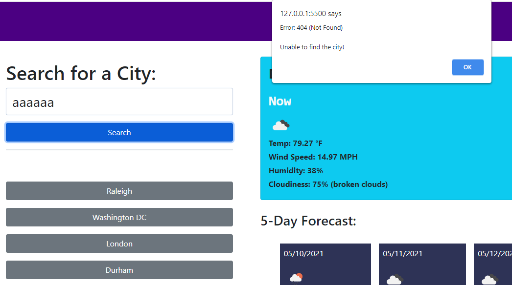

# Weather-dashboard
This web application will let user enter any city in world to see current weather, and 5-day forecast
### Link to the website
https://markjune95.github.io/weather-dashboard/

### Homepage of the website.

### Searched cities will be saved, and user will be able to click on any saved city to see its weather.

### If user enter an invalid city's name, alert will be displayed. Nothing will be excuted.
